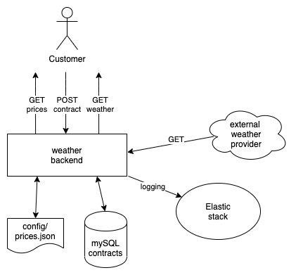
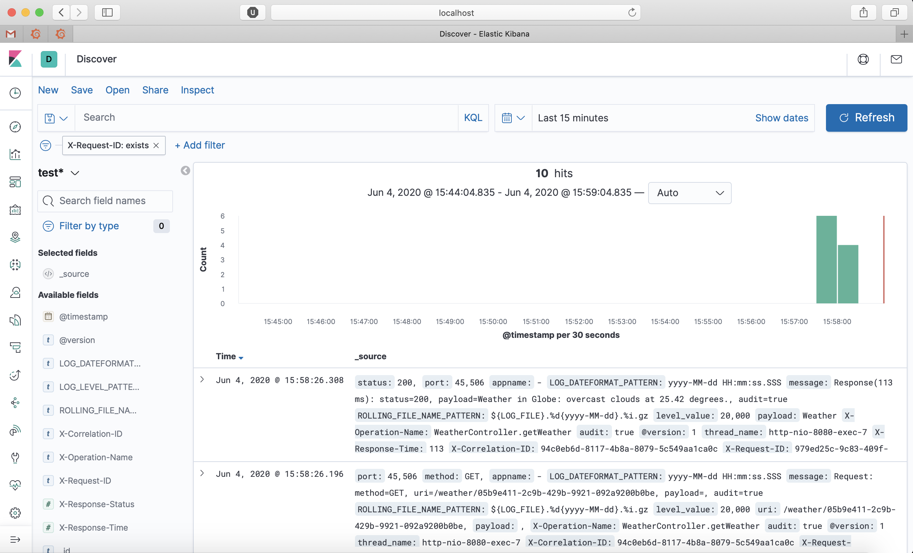

# Simple Weather-Service with Spring


This repo contains a small project that I started to learn and deepen my knowledge, mainly in:
* Java and Spring Boot in general
* Docker / docker-compose
* Behavior Driven Development (using gherkin and python-behave)
    * Local test environments with Wiremock
    * CI (running the tests at each push) with Github Actions
* Logging with the Elastic stack

The use case is the following:
* A user calls the API with latitude and longitude as parameters and in return gets a report of the weather (weather 
information is provided by the external openweathermap API) in the form:
> Weather in Cologne: sunny at 25.11 degrees.
* Only users that have a valid contract are able to make this request.
* Before purchasing a contract, the price models and prices which are setup in a static configuration file can be 
queried.

In this example, only the backend is implemented and the mentioned requests can be made for example with curl from the 
terminal. In a real use case, there should be a frontend that makes these calls.

I will first explain more about the architecture of the system and then explain a bit more about some components that 
I learned most from.


## Walkthrough Live-System

This is how to use the system in "production":
* Docker must be installed
* You need to retrieve an API key from openweathermap.org and put it into the 
[application.properties](./backend/src/main/resources/application.properties). 
* Start the system with `./start --build`. This step includes the maven build, starts the backend including a mySQL 
database and the ELK-Stack (see below) for logging.
* Query the prices: `curl localhost:8080/prices`
* Purchase a contract: `curl -X POST -H "Content-Type: application/json" localhost:8080/contract -d '{"name": "Gerold", 
"model": "default", "price": 0.1}'`. The name can be any. Make sure, however, that price model and price are consistent
with the ones that are configured (and that you got from the last step).
* You can get a list of all active contracts with: `curl localhost:8080/contracts`.
* Query the weather with `curl "http://localhost:8080/<contract id>?lat=<lat>&lon=<lon>"` with your contract ID (which
you retrieved in the post-contract request) and your coordinates.
* You can also check that an exception will be thrown in case you do not give a valid contract.


## Architecture

The following endpoints are offered:
* GET /prices: returns the price models (which are saved in a static config file "prices.json")
* POST /contract: purchase a contract. As payload, a name, a price model and a price has to be sent (where the latter 
ones have to be in accordance with the configured price models)
* GET /contracts: returns a list of all available contracts (queries the data base where all active contracts are saved)
* GET /weather/{contract}: prints a weather report for a location whose coordinates have to be posted as request 
parameter

Configuration (price models and prices) is saved in a static json-file.

A mySQL database is used to save the contracts.

The Elastic stack is spun up to collect and display the logs (see [Logging](#Logging)).

The actual weather information is retrieved from the external openweathermap.org API.




## Some features to learn from

As told before this project is just for learning. In the following I will point at some aspects where I learned most.

### Java
A newbie in Java and working mainly with python up to now, the folder structure was at first intimidating to me: Where 
do I start. However, with the [Spring Initializr](https://start.spring.io) you can easily create a starter for your 
web application and with a good IDE (e.g. IntelliJ) it is no rocket science to extend it step by step.

#### Lombok
When using Lombok, you do not need to write getters and setters for your classes. Instead, you only put an annotation 
such as `@data` (see e.g. [Contract](./backend/src/main/java/weather/model/Contract.java)). You might want to install
a Lombok plugin in your IDE, otherwise it will be irritated that you use getters/setters that are not implemented.

#### Spring Data
Spring Data is an easy way to connect to databases. 
Configuration is done through the application.properties and 
At least for simple transactions in relational databases there is almost no code necessary. See for example this snippet
which is essentially `SELECT * FROM contracts WHERE id=id;`
```
@Transactional
public interface ContractRepository extends JpaRepository<Contract, String> {
    Optional<Contract> findById(String id);
}
```
Also more complicated queries are possible.

While we use a mySQL database in production, an in-memory database can easily be used in unit-tests. 
See the [application.properties](backend/src/test/resources/application.properties) in the test folder for more details.

#### Spring Environments
TBD


### Docker
TBD

### Behavior Driven Development
TBD

#### Local test environment with Wiremock
TBD

Let's assume that Wiremock runs on localhost:3000. We can then post the following mapping:
```
curl -X POST -H "Content-Type: application/json" localhost:3000/__admin/mappings \
-d '{"request": {"method": "GET", "urlPattern": "^/hello(.*)"}, "response": {"body": "hello world", "status": 200}}'
```
When we now make a GET request to localhost:3000 that starts with `hello`, this request will be responded to with 
"hello world" and status 200.

#### CI with GitHub Actions
With GitHub Actions, CI is now completely integrated in GitHub! My pipeline can be found in the default
location [.github/workflows/ci_pipeline.yml](.github/workflows/ci_pipeline.yml) and has three steps:
* Start the test system `start-test.sh`. One the one hand the test system needs to be up so that we can run tests 
against it in the next step. But also, since it includes a build, this step insures that the maven build of the service,
as well as unit tests, are successful.
* Run `ensure_services_ready.sh`: This script ensures that all services are ready.
* Run the feature tests with `test-features.sh`: This script first builds a Docker image that contains python, behave 
and other necessary python library. Then it starts a container from this image to run the feature test in it.


### Logging with the Elastic stack
For logging, I use the logstash-logging-spring-boot-starter library which saves logs, via Logstash, into an 
Elasticsearch database from where they can be queried and displayed in Kibana.


The ELK-Stack (E: Elasticsearch, L: Logstash, K: Kibana) is spun up via [docker-compose](docker-compose-logging.yml). 

The library is rather simple, I only had to include the following dependency in the pom.xml of the backend:
```
<dependency>
    <groupId>com.github.piomin</groupId>
    <artifactId>logstash-logging-spring-boot-starter</artifactId>
    <version>1.2.2.RELEASE</version>
</dependency>
```
and the following two configuration lines in the application.properties file of the backend:
```
logging.logstash.enabled=true
logging.logstash.url=logstash:5000
```

More about the library:
https://piotrminkowski.com/2019/10/02/using-logstash-logging-spring-boot-starter-for-logging-with-spring-boot-and-logstash/